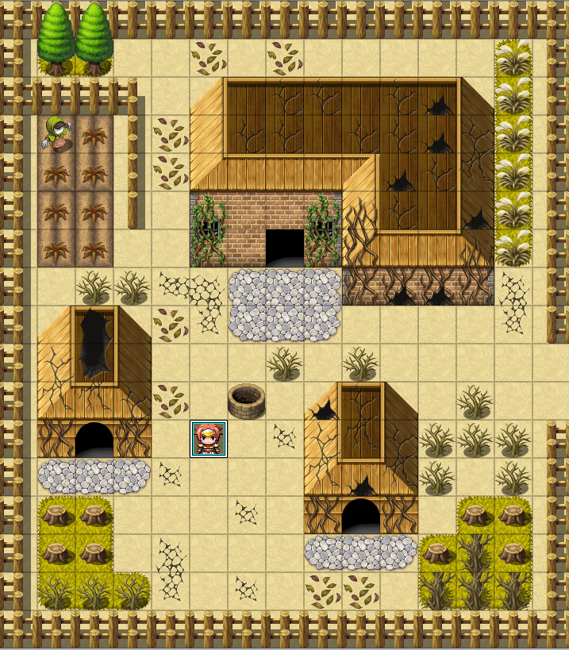
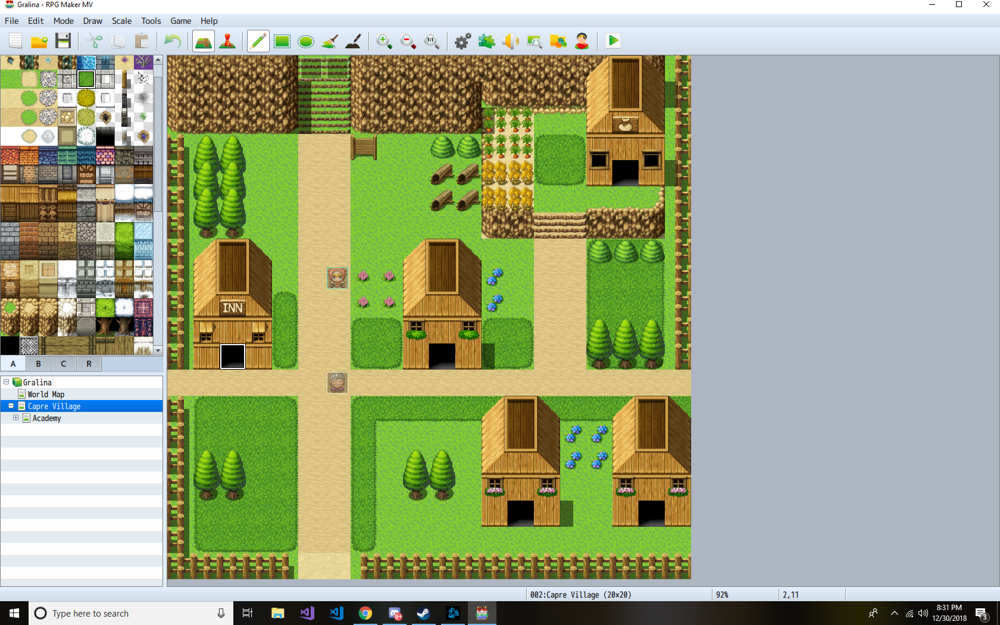

<em>- In Dedication to Robin Perris - </em>
<h1>Gralina - Free 2D ORPG</h1>
<h3>Scernario Designer/Writer &amp; Developer - Nikki Xaysanasy</h3>
<h3>Publisher: <a href="https://mockinbird.dev">mockinbird.dev</a>
<h3>Engine: Intersect Engine</h3>

    <h3>News</h3>
    

    <ul>
             <li>
    <em>September 11, 2023 </em>
    
 Not dead.
    We are now using Intersect Engine to turn this game into an ORPG. (Which was the original idea for the last game in the trilogy). More info soon!
    

    </li>
         <li>
    <em>May 9, 2019</em>
    
 It's dead.
    I forgot to make a back-up before I reformatted my PC. RIP
    

    </li>
     <li>
    <em>March 27, 2019</em>
    

        Made a deserted village today for part of the quest to find out the history of the kingdom as well a a secret that I won't tell! I lived streamed me working on the RPG one day and had some help with some of the viewers. Attached is a screen shot and I hope you guys are still following the progress. Slowly but surely!
    

    
    </li>
                           <li>
    <em>March 16, 2019</em>
    

        Back in Development.
    

    </li>
                            <li>
    <em>February 13, 2019</em>
    

        Hey guys, I have been too focused on looking for a new job and balancing my work-life schedule so I haven't been able to get to working on the game. This is just a small update that even though it's been 2 months I have not forgotten about it but this Sunday I will get back on it. I am looking to form a small team to help me with mapping and database but as of right now, it's just me. In the mean time, wait for some new updates that I'm going to drop this Sunday!. Going to work on the castle now
        
Also DQXI-S has been announced for the Fall, I might not have a life then.

    

    </li>
                        <li>
    <em>December 30, 2018</em>
    

        I made some new developments today. I worked on finishing up the first Village and did a base of the World Map. I have gotten some of the Lore written and because of how the game is to be of a trilogy titled "The Gaiuss Trilogy", I will re-work Cartuga slightly to make sure the transition from the first game to the second game makes sense. I was able to get Switches to work which will create events in the game that would flow like it's an actual RPG. I'm aiming the game to be around 6-10 hours of gameplay where the strong focus of end-game will be in the 3rd game which is TBD. I'll be doing some work only on this game when I have time but with the New Years coming up and I have some free time. I will start working on finishing the events in the first village to carry the main character over to the Castle to see the Chancellor.
        

        Attached below is preview of the first village (not including the Academy on top of the hill)
        

    

     
    </li>
                    <li>
    <em>December 25, 2018</em>
    

    I am back with the development of Gralina. I know I am 8 months behind on dev time but I'm back and at it. I haven't found any original art for our Visual Novel game so we decided to scrap it in the mean time. I began work on Gralina again and going towards a milestone/task schedule where I would work on an area or database structure for one day. I started the Academy and finished the bare bones of it and now I will work on the outside/training area next weekend. Here is the screenshot to show progress. I know I won't make it on time for the schedule I listed below but at least it's going!
    

     
    </li>
                <li>
    <em>August 10, 2018</em>
    

    I have started a new team to help me work on projects but our first project will be a puzzle horror game with the prequel being developed in ren'py. This project will be on hold until then and please visit https://facebook.com/skynitedigital for new updates on our projects!
    

    </li>
            <li>
    <em>June 24th, 2018</em>
    

    A new patch has been released for RPG Maker MV and the end of the month is almost over. I haven't been working much on it but I'm going over the story again to make sure there are no inconsistency in the universe. I'm assuming the gameplay will be under 10 hours and possibily have end-game content. The story is simple but it'll be interesting enough. Starting full devlopment on it starting in July.
    

    </li>
        <li>
    <em>June 4th, 2018</em>
    

    What's up everyone. I just returned to LA last week on Memorial after like a 24+ hour drive. It was long but at least I'm home for now. I got my old computer stuff but I have yet set them up. I'm currently looking for a new apartment and the game is put on hold for a bit. I will be making adjustments to the game story and will continue to read up on tutorials during my free time at work. Hopefully I will be able to show you guys some work soon.
    

    </li>
        <li>
    <em>May 23rd, 2018</em>
    

    My trip to Arkansas starts Friday and I will be driving back on Saturday. I will be driving and hoping I will get back to LA by Monday night. I will continue to write down ideas and work on the database when I can but Devloping does suck using one monitor. My new work station will also be here this summer so I'll dumping most of my free time on this project. New projected demo date will be this Winter and the Full-Release, hopefully Summer 2019.
    

    </li>
    <li>
    <em>May 17th, 2018</em>
    

    Going on a mini vacation starting next week and will probably start on full-production in Mid-June. Will upgrade to a new workstation this summer. I will put in probably about 5-10 hours a week on the game starting then. Winter 2018 will probably end up being Spring/Summer 2019 if I wanna get the game right. I will open up a personal tech blog soon as well. 
    

    </li>
    <li><em>May 9th, 2018</em>
    

        Second Revision of the World Map has begun. Close to finishing the layout. I will most likely start on the database for the game this weekend. Will work on a Vue Website for the whole Trilogy.</li></ul>
    

<h3>Project Timeline</h3>
<ul>
    <li>
        <em>December 2017</em> - Concept of Gralina began</li>
    <li>
        <em>March 2018</em> - Storyboard of Gralina began</li>
    <li>
        <em>May 2018</em> - 1st Stage Development began</li>
    <li>
        <em>Winter 2018</em> - Projected Release Date for Demo
    </li>
        <li>
        <em>Summer 2019</em> - Projected Release Date for 1.0
    </li>
</ul>